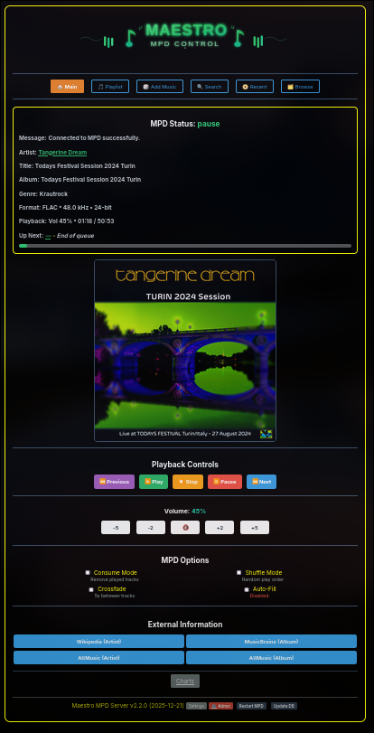
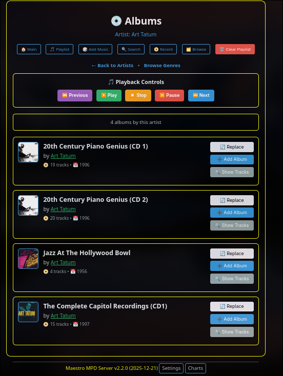
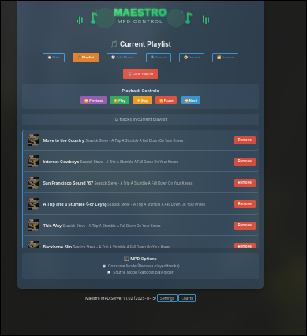
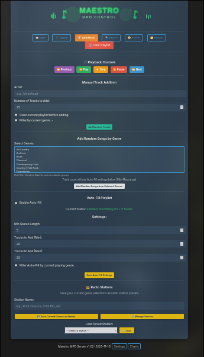
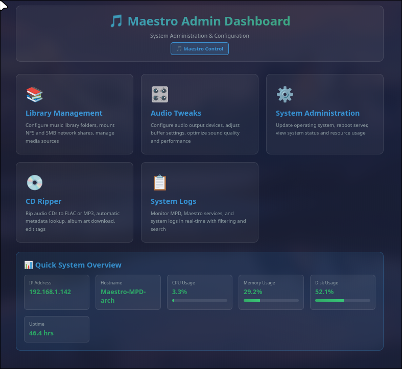
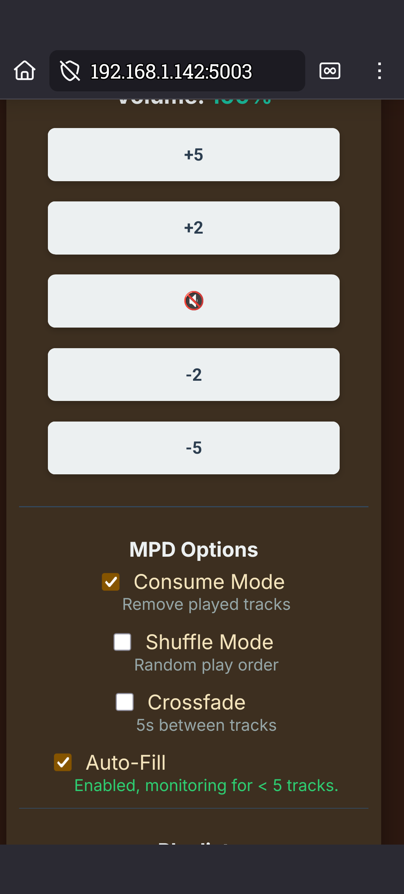

<div align="center">

# 🎵 Maestro MPD Server

### The Ultimate Self-Hosted Music Server with Professional Web Interface

[](https://github.com/coacharnold1/Maestro-Server)
[](LICENSE)
[](https://www.musicpd.org/)
[](https://www.python.org/)
[](https://github.com/coacharnold1/Maestro-Server)

**Transform your music collection into a powerful streaming server with beautiful web UI, automatic CD ripping, Last.fm integration, and comprehensive system management.**

[Features](#-features) • [Quick Start](#-quick-start) • [📹 Video Tour](#-video-walkthrough) • [Screenshots](#-screenshots) • [Documentation](#-documentation)

</div>

---

<!-- 
SCREENSHOT RECOMMENDATION #1: Hero Image
- Take a screenshot of the main player interface showing:
  * Album art displayed
  * Playing track with artist/album info
  * Progress bar showing playback
  * Volume control visible
  * Queue with a few songs
- Use a visually appealing theme (Desert, Sunset, or Forest work well)
- Capture at 1920x1080 or similar 16:9 resolution
- Save as: screenshots/hero-player.png
- Place the image below this comment like:
  
-->


## 📹 Video Walkthrough

<div align="center">

[](https://youtu.be/hCz-VLTOxZY)

**[▶️ Watch the Complete Visual Tour on YouTube](https://youtu.be/hCz-VLTOxZY)**

*Silent walkthrough demonstrating installation, web interface, admin panel, and all major features*

</div>

---

## 🎯 Why Maestro?

**Maestro** is not just another MPD web interface - it's a complete music server ecosystem designed for audiophiles, self-hosters, and music enthusiasts who demand:

✨ **Professional-grade features** - CD ripping, multi-disc detection, Last.fm scrobbling  
🎨 **Beautiful UI** - 8 gorgeous themes, mobile-responsive, modern design  
🔧 **Full system control** - NFS/SMB mounts, audio configuration, OS updates, real-time monitoring  
🚀 **Zero-hassle setup** - One-command installation, automatic MPD detection, smart defaults  
🎵 **Audiophile-ready** - Bit-perfect playback, DSD support, hardware device selection  
📀 **Automatic CD ripping** - Insert disc → automatic rip → organized library  

<!-- 
SCREENSHOT RECOMMENDATION #2: Theme Showcase
- Create a composite image showing 3-4 different themes
- Show the same screen (like Browse Albums) in different themes
- Arrange in a grid (2x2 or 1x4)
- Themes to feature: Dark, High Contrast, Desert, Sunset
- Save as: screenshots/themes.png
- Place below this comment
-->

## ✨ Features

### 🎧 Modern Web Interface (Port 5003)

<details>
<summary><b>Click to expand full feature list</b></summary>

#### Music Playback & Control
- 🎵 Full MPD control (play, pause, stop, next, previous)
- 🔊 Volume control with visual feedback
- 📊 Real-time playback progress
- 🔀 Shuffle and repeat modes
- 📻 HTTP audio streaming
- ⏱️ Track time display and seek

#### Library Browsing
- 📀 **Album browsing** with album art
- 🎤 **Artist browsing** with smart letter jump navigation (shows when >50 artists)
- 🎼 **Genre filtering** with letter jump navigation
- 🆕 **Recent albums** page (tracks newly added/ripped music)
- 🔍 **Smart search** across artists, albums, and tracks
- 💿 **Multi-disc detection** with proper disc organization

#### Queue Management
- 📝 Current playlist view
- ➕ Add albums/tracks to queue
- 🗑️ Clear playlist
- 🎯 Play from queue position

#### Advanced Features
- 📈 **Playback charts** - track your listening stats
- 🎨 **8 beautiful themes**: Dark, Light, High Contrast, Desert, Terminal, Sunset, Forest, Midnight
- 📱 **Mobile-responsive** design
- 🎵 **Last.fm integration** - scrobbling with on-screen toast notifications
- 🔔 **Smart toasts** - database updates, scrobbles, now playing

</details>

<!-- 
SCREENSHOT RECOMMENDATION #3: Browse Albums View
- Show the album browse page with:
  * Multiple album covers visible in grid
  * Album art displaying properly
  * Clean, organized layout
- Use a theme that shows album art well (Dark or High Contrast)
- Save as: screenshots/browse-albums.png
-->

### ⚙️ Powerful Admin Interface (Port 5004)

<details>
<summary><b>Click to expand admin features</b></summary>

#### System Monitoring
- 📊 **Real-time stats**: CPU, RAM, disk usage, network traffic
- 📈 **Live graphs** updating every 2 seconds
- 💾 **Disk space** monitoring with mount point details
- 🌡️ **System health** at a glance

#### Library Management
- 📂 **NFS/SMB mount management**
  - Add network shares through web UI
  - Mount/unmount operations
  - Mount status monitoring
- 📚 **MPD library structure** view with mount indicators
- 🔄 **Smart library updates** with verification
- 📊 **Optimized file counting** for network shares

#### Audio Configuration
- 🎚️ **Audio device selection** with hardware scanning
- 🎛️ **Bit-perfect playback** configuration
- 🔊 **Buffer size** optimization (2048-16384)
- 🎵 **Resampling quality** settings
- 🎼 **DSD playback** mode configuration
- 🔧 **System audio optimizations** (CPU governor, swappiness)

#### System Administration
- 📦 **OS package updates** with real-time progress
- 🔄 **Service management** (MPD, Web UI, Admin)
- 🖥️ **System reboot** with countdown
- 📋 **System logs** viewer
- 🔐 **Secure sudo** configuration

#### CD Ripping & Automation
- 📀 **Automatic CD detection** via udev rules
- 🎵 **Automatic ripping** to FLAC with FreeDB metadata
- 📝 **Configurable rip settings** (format, quality, behavior)
- 📊 **Rip status monitoring**
- 🗂️ **Organized output** to /media/music/ripped/

</details>

<!-- 
SCREENSHOT RECOMMENDATION #4: Admin Dashboard
- Show the system admin page with:
  * CPU/RAM/Disk stats visible
  * Network traffic graphs
  * Clean, professional layout
- Save as: screenshots/admin-dashboard.png
-->

## 🚀 Quick Start

### One-Command Installation

```bash
git clone https://github.com/coacharnold1/Maestro-Server.git
cd Maestro-Server
./install-maestro.sh
```

**That's it!** The installer will:
1. ✅ Detect existing MPD or install new
2. ✅ Configure music directories
3. ✅ Set up Web UI (port 5003) and Admin API (port 5004)
4. ✅ Create systemd services
5. ✅ Configure permissions and audio settings

⏱️ **Installation time:** ~5 minutes

### Post-Installation

Access your new music server:
- 🌐 **Web Player**: `http://YOUR_IP:5003`
- ⚙️ **Admin Panel**: `http://YOUR_IP:5004`
- 🎵 **MPD Port**: `YOUR_IP:6600`

<!-- 
SCREENSHOT RECOMMENDATION #5: Installation Success
- Capture the terminal output showing successful installation
- Include the final "UPDATE COMPLETED SUCCESSFULLY" box
- Show the service status (both running)
- Save as: screenshots/install-success.png
-->

## 📸 Screenshots

### Main Player Interface

*Beautiful player interface with album art, queue management, and playback controls*

### Theme Variety


*Choose from 8 beautiful themes to match your style*

### Library Browsing

*Grid view of your album collection with cover art*


*Intuitive browsing with multiple view options*


*Keep track of newly added albums to your library*

### Playback Features

*Manage your current playlist with drag-and-drop*


*Random playback and user created custom radio stations *


*Powerful search across your entire music library*


*View your Last.fm listening charts and statistics*

### Settings & Configuration

*Comprehensive settings for customization and Last.fm integration*

### Admin Dashboard

*Powerful admin interface with system monitoring and library management*

### Mobile Responsive



*Fully responsive design that works beautifully on mobile devices*

## 🎯 Use Cases

**Perfect for:**

- 🏠 **Home music servers** - Central music hub for whole house audio
- 🎧 **Audiophiles** - Bit-perfect playback with DSD support
- 💿 **CD collectors** - Automatic ripping with metadata lookup
- 🖥️ **Raspberry Pi** - Lightweight, efficient music server
- 🌐 **Remote access** - Stream your collection from anywhere
- 📚 **Large libraries** - Handles 100,000+ tracks with ease
- 🎵 **Multi-room** - MPD's network architecture for zone control

## 🛠️ System Requirements

### Minimum Requirements
- **OS**: Ubuntu 20.04+, Debian 11+, or Arch Linux
- **RAM**: 1GB (2GB+ recommended)
- **Storage**: 1GB + your music library
- **Network**: Ethernet or WiFi
- **Audio**: Any ALSA-compatible device (optional for headless)

### Recommended Hardware
- **Raspberry Pi 4** (4GB RAM) - Perfect balance
- **Intel NUC** - More power for large libraries
- **Dedicated Linux server** - Ultimate performance

### Tested Platforms
- ✅ Ubuntu Server 22.04 LTS
- ✅ Debian 12 (Bookworm)
- ✅ Raspberry Pi OS (64-bit)
- ✅ Arch Linux

## 📦 What Gets Installed

```
~/maestro/
├── web/                      # Web UI (Port 5003)
│   ├── venv/                # Python virtual environment
│   ├── app.py               # Flask web server
│   ├── templates/           # HTML templates
│   └── static/              # CSS, JS, images
├── admin/                    # Admin API (Port 5004)
│   ├── venv/                # Python virtual environment
│   ├── admin_api.py         # Flask admin server
│   └── templates/           # Admin HTML
├── scripts/                  # Automation scripts
│   └── cd-inserted.sh       # CD auto-rip handler
└── logs/                     # Application logs

/etc/systemd/system/
├── maestro-web.service      # Web UI service
└── maestro-admin.service    # Admin API service

/etc/udev/rules.d/
└── 99-maestro-cd.rules      # CD detection rules

/media/music/                 # Music library (configurable)
└── ripped/                   # Auto-ripped CDs
```

## 🔧 Configuration

### Quick Configuration

All settings accessible through web interfaces - no config file editing needed!

**Web UI Settings** (`http://YOUR_IP:5003/settings`):
- Choose from 8 themes
- Configure Last.fm integration
- Set scrobbling preferences

**Admin Settings** (`http://YOUR_IP:5004`):
- Add NFS/SMB network shares
- Configure audio hardware
- Optimize playback settings
- Manage system updates

### Advanced Configuration

<details>
<summary>Click for advanced config options</summary>

#### Custom Music Directory
Edit during installation or modify `/etc/mpd.conf`:
```bash
music_directory "/your/custom/path"
```

#### Network Binding
Restrict to localhost only:
```bash
sudo systemctl edit maestro-web
# Add: Environment="FLASK_RUN_HOST=127.0.0.1"
```

#### Custom Ports
```bash
# Web UI (default 5003)
sudo systemctl edit maestro-web
# Add: Environment="FLASK_RUN_PORT=8080"

# Admin API (default 5004)
sudo systemctl edit maestro-admin
# Add: Environment="FLASK_RUN_PORT=8081"
```

</details>

## 🌟 Key Features Deep Dive

### 📀 Automatic CD Ripping

Insert a CD and Maestro automatically:
1. Detects disc via udev rule
2. Queries FreeDB for metadata
3. Rips to FLAC (configurable format)
4. Organizes into Artist/Album structure
5. Updates MPD library
6. Shows in "Recent Albums"

**Configure via:** Admin → CD Ripper Settings

### 🎵 Last.fm Integration

Full scrobbling support with visual feedback:
- "Now Playing" updates on track start
- Scrobbles after 50% playback or 4 minutes
- On-screen toast notifications (optional)
- Detailed setup wizard in Settings

### 📊 Letter Jump Navigation

Browse large libraries efficiently:
- Automatically appears for artists/genres with >50 entries
- Click letter to jump instantly
- Visual highlight of current position
- Mobile-optimized buttons

### 💿 Multi-Disc Album Support

Smart handling of box sets and multi-disc albums:
- Automatic disc detection
- Organized disc structure in UI
- Proper track ordering
- Maintains metadata integrity

## 📚 Documentation

- **[FEATURES.md](FEATURES.md)** - Comprehensive feature documentation
- **[ADMIN_INTEGRATION.md](ADMIN_INTEGRATION.md)** - Admin API integration guide
- **[CD_RIPPING_INTEGRATION.md](CD_RIPPING_INTEGRATION.md)** - CD ripper setup guide
- **[Admin README](admin/README.md)** - Admin API endpoints
- **[MPD Documentation](https://www.musicpd.org/doc/)** - Official MPD docs

## 🎬 Getting Started Guide

### 1. Install Maestro
```bash
git clone https://github.com/coacharnold1/Maestro-Server.git
cd Maestro-Server
./install-maestro.sh
```

### 2. Add Your Music

**Option A: Local Files**
```bash
cp -r /path/to/your/music/* /media/music/
sudo systemctl restart mpd
```

**Option B: Network Share**
1. Open `http://YOUR_IP:5004`
2. Go to **Library Management**
3. Click **Add Mount**
4. Enter NFS/SMB details
5. Click **Mount** and **Update MPD Library**

### 3. Configure Audio (Optional)
1. Open `http://YOUR_IP:5004`
2. Go to **Audio Tweaks**
3. Select your audio device
4. Configure bit-perfect playback
5. Save and restart MPD

### 4. Start Listening!
1. Open `http://YOUR_IP:5003`
2. Browse your library
3. Add songs to queue
4. Press play! 🎵

## 🔐 Security

### Sudo Configuration
Maestro configures limited passwordless sudo in `/etc/sudoers.d/maestro` for:
- System updates
- Service management
- Mount operations
- Audio device access

### Network Security
Both services bind to `0.0.0.0` by default for easy access. To restrict:

```bash
# Restrict to localhost
sudo systemctl edit maestro-web
# Add: Environment="FLASK_RUN_HOST=127.0.0.1"
```

**Recommended**: Use nginx/apache reverse proxy with authentication for public exposure.

## 🐛 Troubleshooting

<details>
<summary><b>Web UI won't start</b></summary>

```bash
# Check status
sudo systemctl status maestro-web

# View logs
journalctl -u maestro-web -n 50

# Test manually
cd ~/maestro/web
source venv/bin/activate
python3 app.py
```
</details>

<details>
<summary><b>MPD connection failed</b></summary>

```bash
# Check MPD status
sudo systemctl status mpd

# Test connection
mpc status

# Verify port
sudo netstat -tlnp | grep 6600
```
</details>

<details>
<summary><b>No audio output</b></summary>

```bash
# List audio devices
aplay -l

# Test playback
speaker-test -c2 -t wav

# Check MPD audio output
sudo vim /etc/mpd.conf
# Ensure audio_output section is correct
```
</details>

<details>
<summary><b>Network mount failed</b></summary>

```bash
# Test mount manually
sudo mount -t nfs server:/path /media/music/test

# Check connectivity
ping server_ip

# Verify NFS tools
which mount.nfs
```
</details>

## 🔄 Updating

Keep Maestro up to date:

```bash
cd ~/Maestro-Server
./update-maestro.sh
```

The updater:
- ✅ Pulls latest code from GitHub
- ✅ Preserves your settings
- ✅ Updates dependencies
- ✅ Restarts services
- ✅ Migrates configuration if needed

## 🤝 Contributing

Contributions are welcome! Please:

1. Fork the repository
2. Create a feature branch (`git checkout -b feature/amazing-feature`)
3. Commit your changes (`git commit -m 'Add amazing feature'`)
4. Push to the branch (`git push origin feature/amazing-feature`)
5. Open a Pull Request

## 📜 License

This project is licensed under the MIT License - see the [LICENSE](LICENSE) file for details.

## 🙏 Credits

Built with love and these amazing technologies:

- [Music Player Daemon (MPD)](https://www.musicpd.org/) - The core audio engine
- [Flask](https://flask.palletsprojects.com/) - Web framework
- [python-mpd2](https://github.com/Mic92/python-mpd2) - Python MPD client
- [psutil](https://github.com/giampaolo/psutil) - System monitoring
- [abcde](https://abcde.einval.com/) - CD ripping
- [pylast](https://github.com/pylast/pylast) - Last.fm integration

## 💬 Community & Support

- 🐛 **Bug Reports**: [GitHub Issues](https://github.com/coacharnold1/Maestro-Server/issues)
- 💡 **Feature Requests**: [GitHub Discussions](https://github.com/coacharnold1/Maestro-Server/discussions)
- 📧 **Contact**: [Your Email/Contact]

## ⭐ Show Your Support

If you find Maestro useful, please consider:
- ⭐ Starring the repository
- 🐦 Sharing on social media
- 📝 Writing a blog post about your setup
- 🤝 Contributing code or documentation

---

<div align="center">

**Made with ❤️ for the music community**

[⬆ Back to Top](#-maestro-mpd-server)

</div>
