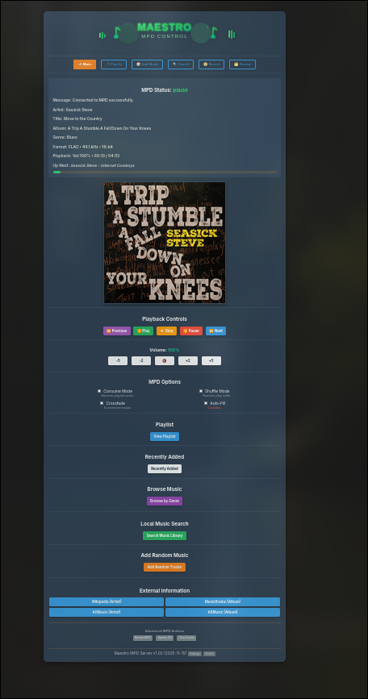

# 🎵 Maestro MPD Control - Docker Edition

[](https://www.docker.com/)
[](LICENSE)
[](https://www.musicpd.org/)
[](https://www.last.fm/)

A modern, responsive web interface for **Music Player Daemon (MPD)** with complete Docker support. Features 4 beautiful themes, mobile-responsive design, and advanced music management capabilities including recently fixed album discovery.


*Screenshot showing the Desert theme with album art and playback controls*

Take a Tour **[PROJECT_SHOWCASE.md](PROJECT_SHOWCASE.md)**

## ✨ Features

### 🎨 **Beautiful User Interface**
- **4 Complete Themes**: Dark, Light, High Contrast, Desert
- **📱 Mobile Responsive**: Perfect experience on any device
- **🎨 Real-time Updates**: Live playback status via WebSockets
- **🖼️ Album Art**: Local folder images + Last.fm fallback

### 🎵 **Advanced Music Management**
- **🏆 Recent Albums**: Fixed! Automatically displays 25 most recently added albums
- **📻 Genre Stations**: Save and manage genre-based genre stations
- **🤖 Smart Auto-Fill**: Intelligent playlist management with Last.fm
- **🔍 Advanced Search**: Comprehensive music library search
- **📈 Last.fm Integration**: Charts, scrobbling, and music discovery
- **🎹 Full MPD Control**: Play, pause, volume, shuffle, crossfade

### 🐳 **Docker Ready**
- **Multi-Container Setup**: Separate MPD and web application containers
- **Flexible Deployment**: Support for both containerized and external MPD
- **📦 One-Command Setup**: Interactive installation script
- **🔒 Security Hardened**: Non-root user execution
- **💾 Data Persistence**: Settings and cache survive restarts

## 🚀 Quick Start

**🎯 One command. Auto-configured audio. Ready in 2 minutes.**

### Prerequisites
- Docker and Docker Compose installed
- Music directory accessible to Docker  
- (Optional) **Last.fm API credentials** for charts/scrobbling - [Get yours here →](https://www.last.fm/api/account/create)

### One-Command Installation

#### 🐧 **Linux/macOS**
```bash
git clone https://github.com/coacharnold1/Maestro-MPD-Control.git
cd Maestro-MPD-Control
./setup.sh
```

**🎧 Automatic Audio Setup:**
- **🔍 Auto-Detection**: PipeWire/PulseAudio/ALSA automatically detected
- **🔊 Native Audio**: Music plays through your system speakers/headphones  
- **🌐 HTTP Backup**: `http://localhost:8001` for browser/remote access
- **⚡ Performance Optimized**: Fast controls, smart caching, optimized timeouts

**✨ What happens:**
1. Script detects your audio system (PipeWire/PulseAudio/ALSA)
2. Configures Docker for native audio access
3. Sets up permissions automatically  
4. Launches with optimal settings for your hardware

**🎛️ Result**: Full music control at `http://localhost:5003` with native audio!

#### 🖥️ **Windows** ⚠️ **Audio Note**
```powershell
# Download/extract project, then run as Administrator:
.\setup-windows.ps1
```

See **[WINDOWS_SETUP.md](WINDOWS_SETUP.md)** for complete platform-specific instructions including:
- **🎧 Native MPD vs HTTP Streaming**: Choose true system audio or browser playback
- WSL2 setup (recommended)
- PowerShell automated setup  
- Git Bash alternative
- Windows audio testing guide
- Windows troubleshooting guide

### Interactive Setup Features

The interactive setup script will guide you through:
- Music directory configuration
- MPD server setup (containerized vs external)
- Theme selection
- Last.fm integration
- Automatic service startup

### Manual Installation

1. **Copy environment template:**
   ```bash
   cp .env.example .env
   ```

2. **Edit configuration:**
   ```bash
   nano .env
   # Set your MUSIC_DIRECTORY path
   ```

3. **Start with containerized MPD** (recommended):
   ```bash
   COMPOSE_PROFILES=with-mpd docker-compose up -d
   ```

   **Or connect to existing MPD:**
   ```bash
   # Set MPD_HOST=host.docker.internal in .env
   docker-compose up -d
   ```

4. **Access the interface:**
   ```
   http://localhost:5003
   ```

## 📖 Documentation

| Document | Description |
|----------|-------------|
| [DOCKER_USAGE.md](DOCKER_USAGE.md) | Complete Docker deployment guide |
| [CHANGELOG.md](CHANGELOG.md) | Version history and features |
| [Configuration](#configuration) | Environment variables and settings |

## 🎨 Theme Gallery

| Dark | High Contrast | Desert |
|------|---------------|--------|
|  |  |  |


### Environment Variables

| Variable | Default | Description |
|----------|---------|-------------|
| `MUSIC_DIRECTORY` | **Required** | Path to your music library |
| `MPD_HOST` | `mpd` | MPD server hostname |
| `MPD_PORT` | `6600` | MPD server port |
| `WEB_PORT` | `5003` | Web interface port |
| `DEFAULT_THEME` | `dark` | Default UI theme |
| `RECENT_MUSIC_DIRS` | - | Comma-separated dirs for Recent Albums (performance) |
| `LASTFM_API_KEY` | - | Last.fm API key (optional) |
| `LASTFM_SHARED_SECRET` | - | Last.fm shared secret (optional) |

### 🚀 Recent Albums - Now Working!

**✅ Fixed!** Recent albums now automatically scans your entire music library and displays the 25 most recently added albums.

```bash
# Optional performance optimization - specify dirs with newest music:
RECENT_MUSIC_DIRS=New Releases,2024,2025,Latest Albums
```

- **🔄 Auto-Fallback**: Automatically scans full library if no specific dirs configured
- **⚡ Fast Performance**: Efficient scanning finds albums in ~0.1 seconds
- **📂 Smart Detection**: Finds albums by modification date across your entire library
- **🎯 Optional Targeting**: Specify directories for even faster performance

### Docker Compose Profiles

| Profile | Services | Use Case |
|---------|----------|----------|
| (default) | Web only | Connect to existing MPD |
| `with-mpd` | Web + MPD | Full containerized setup |

## 🔊 Audio Output

**Universal solution that works everywhere:**


**✅ Platform Support:**
- **🐧 Linux**: Works + Native audio option available
- **🖥️ Windows**: **Primary solution** (Docker containers can't access Windows audio, Powershell script installs and configures windows MPD server - run the autostart script and set Docker to start on boot)
- **🍎 macOS**: Works + Native audio option available

|***** [WINDOWS INSTALL](WINDOWS_NATIVE_MPD.md) | Environment variables and settings ****|

**✅ Features:**
- 🌐 **Browser playbook**: Direct streaming to web interface  
- 📱 **Mobile friendly**: Stream to phone/tablet browsers
- 🎧 **External players**: VLC, MPV, etc. can play the stream
- 🚫 **No permissions**: No special Docker audio setup needed


### 🌐 HTTP Streaming (Default for All Platforms)
```bash
# Audio streams to: http://localhost:8001
# Play in browser or media player that supports HTTP streams
```

### 🔊 Direct System Audio (Linux/macOS Only)

**⚠️ Windows users: Skip this - use HTTP streaming above**

**For users wanting direct system audio output:**

```bash
# Linux (ALSA)
docker run --device /dev/snd:/dev/snd ...

# Linux (PulseAudio)  
docker run -v /run/user/1000/pulse:/run/user/1000/pulse ...
```

**⚠️ Platform Limitations:**
- **🐧 Linux**: Both HTTP streaming AND direct audio supported
- **🖥️ Windows**: HTTP streaming ONLY (Docker cannot access Windows audio)  
- **🍎 macOS**: HTTP streaming recommended (direct audio complex)

### 🧪 Audio Testing by Platform

**🐧 Linux (Native Audio):**
```bash
# Test system audio
./setup.sh  # Auto-detects and configures PulseAudio/ALSA
# Music should play through speakers/headphones
```

**🖥️ Windows (HTTP Stream):**
```powershell
# Test HTTP stream  
curl http://localhost:8001  # Should stream audio data

# Play via browser
start http://localhost:8001  

# Or use VLC (recommended)
vlc http://localhost:8001
```

**🍎 macOS (HTTP Stream):**
```bash
# Test HTTP stream
curl http://localhost:8001  # Should return audio data

# Play in browser
open http://localhost:8001  # Safari/Chrome/Firefox
```

## 📱 Mobile & Responsive Design

Fully responsive design optimized for:
- **📱 Phones**: Touch-friendly controls, stacked layouts
- **📲 Tablets**: Optimized button sizing and spacing  
- **💻 Desktop**: Full feature set with large album art

## 🎵 Last.fm Integration

**📋 Setup Required:** Get free API credentials at **https://www.last.fm/api/account/create**

Connect your Last.fm account for:
- **📊 Personal Charts**: Top artists, albums, and tracks
- **📈 Scrobbling**: Automatic play tracking
- **🎶 Music Discovery**: Similar artist recommendations
- **📋 Playlist Integration**: Add chart items directly to playlist

**Configuration:** Add your API key and shared secret during setup or in the Settings page.

## 🔧 Management Commands

```bash
# View service status
docker-compose ps

# View logs
docker-compose logs -f

# Stop services
docker-compose down

# Restart services
docker-compose restart

# Update containers
docker-compose pull && docker-compose up -d
```

## 📊 Architecture

```
┌─────────────────┐    ┌─────────────────┐    ┌─────────────────┐
│   Web Browser   │    │   MPD Client    │    │   Last.fm API   │
│                 │    │   (Optional)    │    │   (Optional)    │
└─────────┬───────┘    └─────────┬───────┘    └─────────┬───────┘
          │                      │                      │
          │ HTTP/WebSocket       │ MPD Protocol         │ HTTPS
          │                      │                      │
┌─────────▼───────┐    ┌─────────▼───────┐              │
│  Web Container  │◄───┤  MPD Container  │              │
│                 │    │   (Optional)    │              │
│  - Flask App    │    │  - Music Player │              │
│  - SocketIO     │    │  - Database     │              │
│  - Album Art    │    │  - Audio Output │              │
│  - Last.fm      │────┼─────────────────┘──────────────┘
└─────────┬───────┘    │
          │            │
          ▼            ▼
┌─────────────────────────┐
│    Docker Volumes       │
│  - Settings & Cache     │
│  - MPD Database         │
│  - Playlist Data        │
└─────────────────────────┘
```

## 🤝 Contributing

1. Fork the repository
2. Create a feature branch (`git checkout -b feature/amazing-feature`)
3. Commit your changes (`git commit -m 'Add amazing feature'`)
4. Push to the branch (`git push origin feature/amazing-feature`)
5. Open a Pull Request

## 📄 License

This project is licensed under the MIT License - see the [LICENSE](LICENSE) file for details.

## 🙏 Acknowledgments

- **[Music Player Daemon](https://www.musicpd.org/)** - The excellent audio player
- **[Last.fm](https://www.last.fm/)** - Music metadata and discovery
- **[Flask](https://flask.palletsprojects.com/)** - Web framework
- **[Docker](https://www.docker.com/)** - Containerization platform

---

## 📞 Support

- 🐛 **Bug Reports**: [GitHub Issues](https://github.com/yourusername/mpd-web-control-docker/issues)
- 💬 **Discussions**: [GitHub Discussions](https://github.com/yourusername/mpd-web-control-docker/discussions)
- 📚 **Documentation**: [Wiki](https://github.com/yourusername/mpd-web-control-docker/wiki)

**⭐ Star this repository if you find it useful!**

## 🔄 Recent Updates (November 17, 2025)

### ✅ Major UI & Theme Enhancements
- **NEW:** Desert Theme - warm brown/tan color scheme with reddish borders
- **FIXED:** Mobile footer layout - stacked vertical layout instead of cramped inline separators
- **STANDARDIZED:** Mobile playback controls - consistent full-width buttons across all pages
- **ENHANCED:** Border consistency - unified border-radius design system (15px containers, 10px cards, 6px buttons, 4px small)
- **RESOLVED:** MPD stability - fixed memory buffer overflow issues (reduced from 3.2GB to 162MB usage)
- **ADDED:** Input overflow fixes - station name input box sizing correction

### 🎨 Complete Theme System
- **Dark Theme:** Default dark interface
- **Light Theme:** Clean light interface  
- **High Contrast:** Accessibility-focused yellow on black
- **Desert Theme:** NEW warm brown/tan with reddish borders
- **Mobile Optimized:** All themes work perfectly on mobile devices

### 🚀 App Status
- **Running on:** Port 5003 (configurable)
- **Status:** Production-ready with enhanced UI consistency and theme system
- **Platform:** Optimized for Arch Linux with systemd service
- **Backup:** mpd_web_control_backup_20251117_164850

## Previous Updates (November 13, 2025)

### ✅ Major Features & Enhancements
- **NEW:** Genre Station Auto-Fill Enhancement - maintains genre diversity during auto-fill
- **NEW:** Navigation Standardization - consistent emoji-based navigation across all pages
- **NEW:** Genre Station Mode - preserves original station genres instead of switching to "now playing" 
- **ENHANCED:** Auto-fill status display shows genre station information and genre counts
- **FIXED:** Playback timing issues - eliminated "failed to start playbook" errors
- **IMPROVED:** Album art integration in playlist page with thumbnail display
- **ADDED:** Professional UI consistency with current page indicators

### 🎛️ Genre Station System
- **Save/Load/Play:** Complete genre station management with genre preservation
- **Auto-Fill Integration:** Radio stations maintain original genre sets during auto-fill
- **Status Display:** Rich information showing active station and genre count
- **Mode Management:** Automatic switching between normal and genre station auto-fill modes

## Features

### Core MPD Control
- ✅ Play, pause, next, previous controls
- ✅ Volume control with real-time updates
- ✅ Current song display with progress tracking
- ✅ Queue management and playlist controls
- ✅ Consume mode toggle
- ✅ Shuffle mode with cross-page synchronization

### Advanced Features
- 🎵 **Last.fm Integration**: Album art fetching and similar artist suggestions
- 🔍 **Search Functionality**: Search your music library by artist, album, title, or any field
- 🤖 **Auto-Fill Playlists**: Automatically add similar tracks when queue gets low
- � **Genre Stations**: Save, load, and play genre-based genre stations with auto-fill integration
- �🖼️ **Album Art Display**: Local folder art + Last.fm fallback with thumbnail support
- 📱 **Real-time Updates**: WebSocket-powered live status updates
- 🎛️ **Smart Filtering**: Genre-based filtering for auto-fill with genre station mode
- ✨ **Genre Selection**: Multi-select random music by genre with station save/load

### User Interface
- 📱 Responsive design for desktop and mobile
- 🎨 Clean, modern interface with consistent styling
- ⚡ Real-time status updates via SocketIO
- 💬 Live feedback messages with professional notifications
- 🗑️ Clear playlist functionality on all relevant pages

## Requirements

- Python 3.7+
- MPD (Music Player Daemon) running and accessible
- Music library with organized files

## Quick Start

### 1. Install Dependencies
```bash
# Create virtual environment
python3 -m venv venv
source venv/bin/activate  # On Windows: venv\Scripts\activate

# Install requirements
pip install -r requirements.txt
```

### 2. Configure Settings
```bash
# Copy and edit configuration
cp config.env.example config.env
nano config.env  # Edit with your settings
```

### 3. Run the Application
```bash
python app.py
```

The web interface will be available at `http://localhost:5000`

## Configuration

All settings are managed through the `config.env` file:

### MPD Settings
- `MPD_HOST`: MPD server hostname (default: localhost)
- `MPD_PORT`: MPD server port (default: 6600)
- `MPD_TIMEOUT`: Connection timeout (default: 10)
- `MUSIC_DIRECTORY`: Path to your music files

### Last.fm API (Optional)
Get your free API credentials from: **https://www.last.fm/api/account/create**

| Variable | Default | Description |
|----------|---------|-------------|
| `LASTFM_API_KEY` | - | Last.fm API key (optional) |
| `LASTFM_SHARED_SECRET` | - | Last.fm shared secret (optional) |

### Application Settings
- `APP_PORT`: Web server port (default: 5000)
- `APP_HOST`: Web server host (default: 0.0.0.0)
- `SECRET_KEY`: Flask secret key for sessions
- `DEBUG`: Enable debug mode (default: False)

## Deployment

### Systemd Service (Linux)

1. Create service file:
```bash
sudo nano /etc/systemd/system/maestro-mpd-control.service
```

2. Add service configuration:
```ini
[Unit]
Description=Maestro MPD Control Panel
After=network.target mpd.service

[Service]
User=your-username
Group=your-username
WorkingDirectory=/path/to/mpd_web_control_combined
ExecStart=/path/to/mpd_web_control_combined/venv/bin/python app.py
Restart=always
RestartSec=5
StandardOutput=syslog
StandardError=syslog
SyslogIdentifier=maestro-mpd-control

[Install]
WantedBy=multi-user.target
```

3. Enable and start:
```bash
sudo systemctl daemon-reload
sudo systemctl enable maestro-mpd-control
sudo systemctl start maestro-mpd-control
```

### Docker Deployment

See `docker/` directory for Docker configuration files.

## Features Overview

### Auto-Fill Functionality
Automatically maintains your playlist by adding similar tracks when the queue gets low:
- Configurable minimum queue length
- Variable number of tracks to add
- Genre filtering option
- Uses Last.fm similar artists API

### Search Capabilities
Powerful search functionality:
- Search by artist, album, title, or any field
- Add individual songs or entire albums to playlist
- Fast, responsive interface

### Album Art Display
Multi-source album art system:
1. Local folder images (folder.jpg, cover.jpg, etc.)
2. Last.fm API album art
3. Generated placeholder as fallback

## Troubleshooting

### Common Issues

**MPD Connection Failed**
- Check MPD is running: `systemctl status mpd`
- Verify MPD configuration in `/etc/mpd.conf`
- Ensure MPD is listening on the correct port

**No Album Art**
- Check music directory path in config.env
- Verify Last.fm API credentials
- Ensure local album art files exist in music folders

**Auto-Fill Not Working**
- Verify Last.fm API key is set
- Check MPD has sufficient music library
- Enable auto-fill in the web interface

### Logs
- Application logs: Check systemd journal with `journalctl -u maestro-mpd-control -f`
- MPD logs: Usually in `/var/log/mpd/mpd.log`

## Development

### Project Structure
```
mpd_web_control_combined/
├── app.py                 # Main application
├── rudimentary_search.py  # Search functionality
├── config.env            # Configuration file
├── config.env.example    # Configuration template
├── requirements.txt      # Python dependencies
├── templates/            # HTML templates
│   ├── index.html        # Main interface
│   ├── add_music.html    # Add music page
│   ├── playlist.html     # Playlist management
│   ├── search.html       # Search interface
│   └── search_results.html # Search results
├── static/              # Static assets (CSS, JS, images)
└── docs/               # Documentation
```

### API Endpoints

- `GET /`: Main interface
- `GET /search`: Search page
- `POST /search`: Execute search
- `GET /playlist`: Playlist management
- `POST /add_random_tracks`: Add similar tracks
- `POST /add_album_to_playlist`: Add entire album
- `POST /add_song_to_playlist`: Add single song
- Plus standard MPD control endpoints

## License

This project is open source. Feel free to modify and distribute.

## Contributing

Contributions welcome! Please:
1. Fork the repository
2. Create a feature branch
3. Make your changes
4. Test thoroughly
5. Submit a pull request

## Credits

- Built with Flask and Flask-SocketIO
- Uses python-mpd2 for MPD communication
- Last.fm integration for music metadata
- Bootstrap for responsive UI

## Backups

Regular backups help preserve configuration and state (e.g., saved genre stations). A helper script `backup.sh` is provided.

### Creating a Backup
```bash
./backup.sh
```
Creates a compressed archive in two locations:
1. Project directory: `backups/mpd_web_control_backup_YYYYmmdd_HHMMSS.tar.gz`
2. Home directory: `~/mpd_web_control_backup_YYYYmmdd_HHMMSS.tar.gz`

### Retention Policy
By default only the two most recent matching backups (pattern: `mpd_web_control_backup_*.tar.gz`) are retained in EACH location; older ones are deleted automatically.

Keep more:
```bash
RETENTION_COUNT=5 ./backup.sh
```

Add a description label:
```bash
DESCRIPTION=pre_upgrade ./backup.sh
```
Result example:
```
mpd_web_control_backup_20251114_182500_pre_upgrade.tar.gz
```

Skip home copy (project-only):
```bash
SKIP_HOME_COPY=1 ./backup.sh
```

Override home destination:
```bash
HOME_BACKUP_DIR=/mnt/backup ./backup.sh
```

### What Is Excluded
- `backups/` (to avoid recursive nesting)
- `venv/` (can be recreated from `requirements.txt`)
- `__pycache__/` (bytecode caches)


## Settings & Last.fm Scrobbling

### Settings Page
- Navigate to `/settings` (or click Settings in the footer) to configure:
	- Theme: Dark / Light / High Contrast / Desert
	- Last.fm: API key and shared secret
	- Scrobbling: toggle on/off

Values are stored in `settings.json` with 0600 permissions. Environment variables still override (recommended for Docker/production).

### Connect to Last.fm
1. Enter your Last.fm API key and shared secret; click Save.
2. Click “Connect to Last.fm” and approve the app on Last.fm (opens in a new tab).
3. Return to Settings and click “Finalize Connection”. This saves your user session key (sk).
4. Enable “Scrobbling” and Save.

We submit:
- `track.updateNowPlaying` when a track starts.
- `track.scrobble` when a track ends or changes and meets one of:
	- Played for at least 50% of duration, or
	- Played for at least 240 seconds.

Security: We never store your Last.fm password—only the session key provided by Last.fm. `settings.json` is written with mode 0600.
